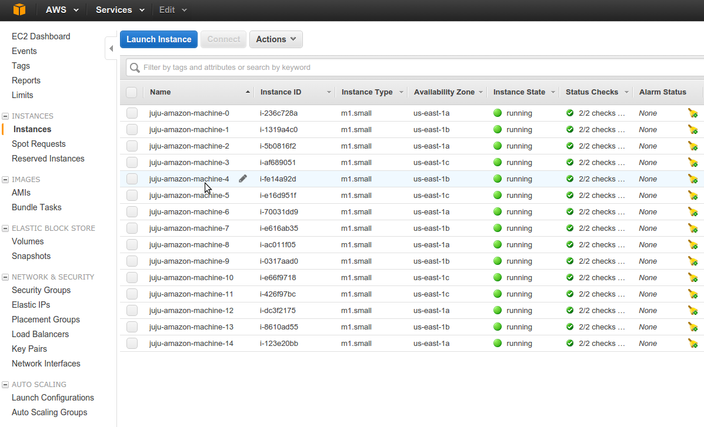
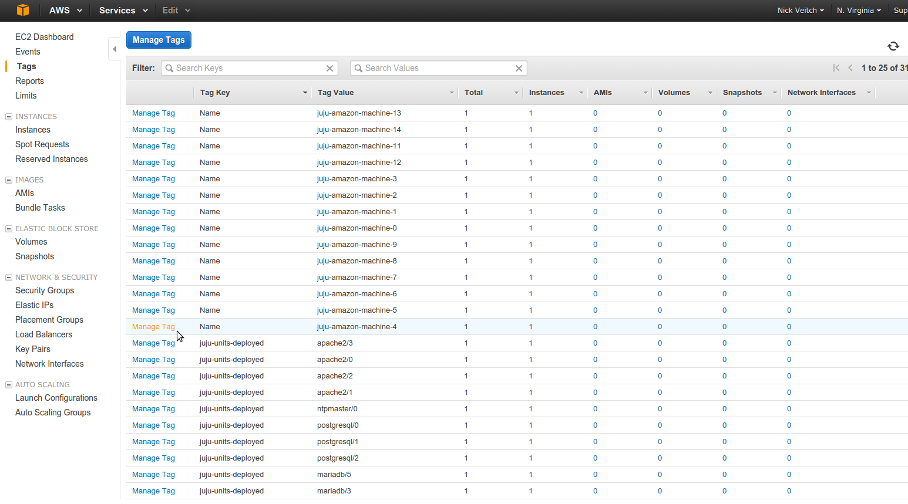
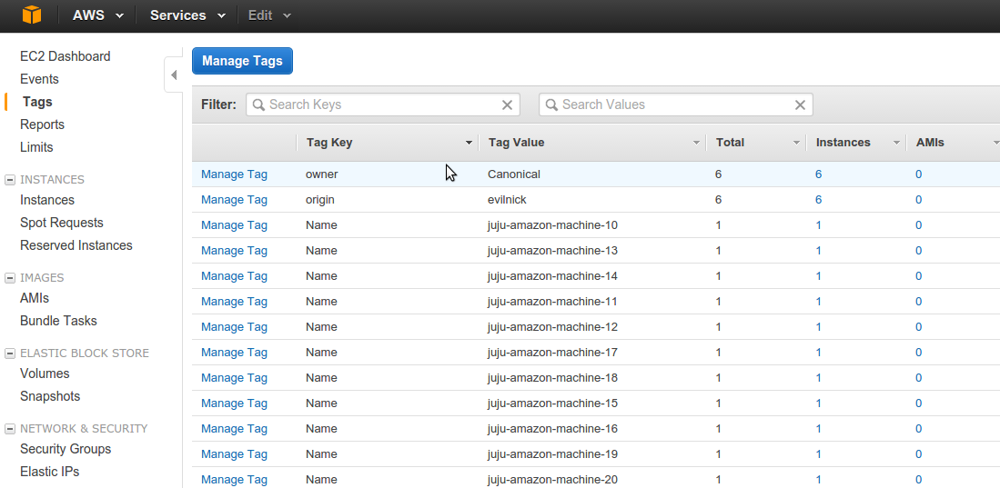

Title: Instance naming and tagging in clouds

# Instance naming and tagging
Juju now tags instances and volumes created in supported clouds with the
Juju environment UUID, and related Juju entities. Instances will be tagged with
the names of units initially assigned to the machine. Volumes will be tagged
with the storage-instance name, and the owner (unit or service) of said storage.


Instances and volumes are now named consistently across EC2 and OpenStack,
using the scheme:

```no-highlight
juju-<env>-<resource-type>-<resource-ID>
```

...where `<env>` is the given name of the model; `<resource-type>` is the type
of the resource ("machine" or "volume") and `<resource-ID>` is the numeric ID
of the Juju machine or volume
corresponding to the IaaS resource.

Names in Amazon AWS for example appear like this:

...and tags like this:


## User-defined tags

Juju also adds any user-specified tags set via the "resource-tags" model
setting to instances and volumes. The format of this setting is a
space-separated list of key=value pairs.

```no-highlight
resource-tags: key1=value1 [key2=value2 ...]
```

Alternatively, you can change the tags allocated to new machines in a
bootstrapped environment by using the `juju model-config` command

```bash
juju model-config resource-tags="origin=v2 owner=Canonical"
```



You can change the tags again by simply running the above command again with
different values. Changes will not be made to existing machines, but the
new tags will apply to any future machines created.

These tags may be used, for example, to set up chargeback accounting.

Any tags that Juju manages will be prefixed with "juju-"; users must avoid
modifying these, and for safety, it is recommended none of your own tags start
with "juju"

